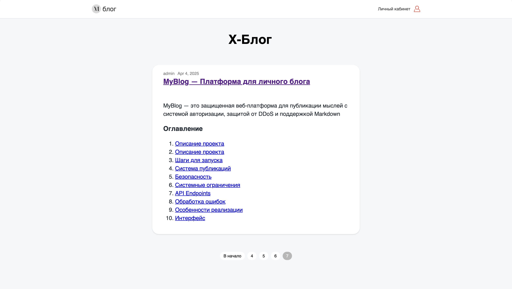
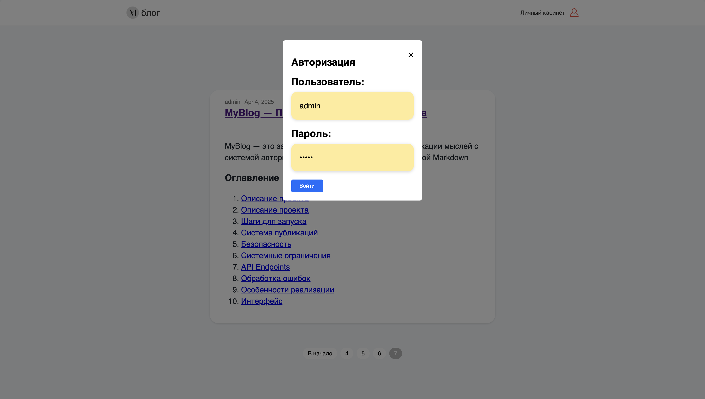
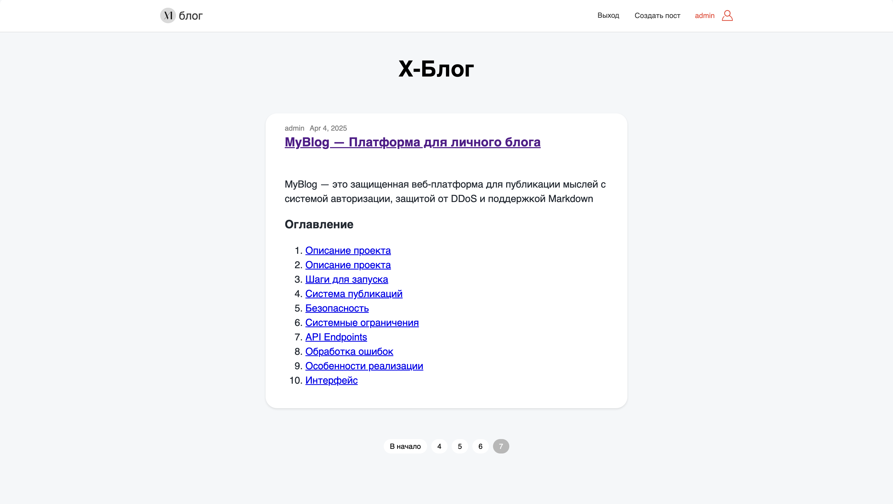
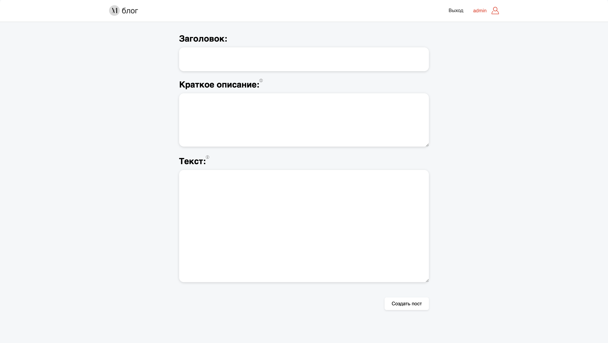

# MyBlog — Платформа для личного блога

## Оглавление

1. [Описание проекта](#i)
2. [Структура проекта](#ii)
3. [Шаги для запуска](#iii)
10. [Иллюстрации](#iv)
11. [Интерфейс](#v)
4. [Система публикаций](#vi)
5. [Безопасность](#vii)
6. [Системные ограничения](#viii)
7. [API Endpoints](#ix)
8. [Обработка ошибок](#x)
9. [Особенности реализации](#xi)

<h2 id="i" >Описание проекта</h2>

MyBlog — это защищенная веб-платформа для публикации мыслей с системой авторизации, защитой от DDoS и поддержкой Markdown. 

Решение позволяет:
- Публиковать контент через админ-панель с авторизацией JWT
- Отображать посты с пагинацией и адаптивным дизайном
- Конвертировать Markdown в HTML с кастомными стилями
- Защищаться от брутфорса (100 запросов/сек)
- Генерировать уникальные логотипы алгоритмически

<h2 id="ii" >Структура проекта</h2>

```
├── cmd/
│   └── blog/
│       └── main.go
│
├── configs/
│   └── credentials/
│       └── admin_credentials.txt
│
├── internal/
│   ├── domain/
│   │   ├── entities/
│   │   │   └── post.go
│   │   └── repositories/
│   │       └── post.go
│   ├── application/
│   │   └── usecase/
│   │       └── post.go
│   ├── interfaces/
│   │   └── http/
│   │       ├── handler/
│   │       │   ├── api.go
│   │       │   ├── auth.go
│   │       │   ├── html.go
│   │       │   ├── model_inline_response_400.go
│   │       │   └── model_template_data.go
│   |       ├── middleware/
│   │       │   ├── admin.go
│   │       │   ├── cors.go
│   │       │   ├── csrf.go
│   │       │   ├── jwt.go
│   │       │   └── logger.go
│   │       └── router/
│   │           └── router.go
│   └── infrastructure/
│       ├── config/
│       │   ├── admin_credentials.go
│       │   ├── db_credentials.go
│       │   ├── jwt_credentials.go
│       │   ├── load_admin_credentials.go
│       │   ├── load_config.go
│       │   ├── load_db_credentials.go
│       │   ├── load_jwt_credentials.go
│       │   └── load_SQL.go
│       ├── logger/
│       │   └── logger.go
│       └── persistence/
│           └── postgres/
│               └── article_repository.go
|
├── static/
|   ├── css/
|   │   └── main.css
|   ├── images/
|   │   ├── favicon_io/
|   │   │   ├── android-chrome-192x192.png
|   │   │   ├── android-chrome-512x512.png
|   │   │   ├── apple-touch-icon.png
|   │   │   └── favicon.ico
|   │   ├── blog_icon.png
|   │   └── user_icon.png
│   │
│   └── logo_template
|
├── templates/
|   ├── admin_create.html
|   ├── authorization.html
|   ├── base.html
|   ├── index.html
|   └── post.html
|
├── go.mod
├── go.sum
└── Makefile
```

<h2 id="iii" >Шаги для запуска</h2>

1. Требования:
   - Go 1.21+
   - PostgreSQL 15+
   - lib/pq драйвер

2. Настройка БД:
    - Убедитесь, что PostgreSQL запущен и доступен для подключения.
    
3. Сборка и запуск:
    ```bash
    make zip
    unzip myblog.zip
    cd myblog
    ./myblog
    ```

    ```bash
    make build   
    ./myblog
    ```
4. Тест защиты от перегрузок:
    - Apache Benchmark (ab) или siege, чтобы протестировать, как приложение обрабатывает большое количество запросов
    ```bash
    ab -n 150 -c 10 http://localhost:8888/
    ```

5. Веб-интерфейс: http://localhost:8888

<h2 id="iv" >Иллюстрации</h2>

#### Главная страница:


#### Авторизация:


#### Админ-панель:


#### Страница поста:


<h2 id="v" >Интерфейс</h2>

1. Главная страница:

   - Логотип проекта

   - Сетка постов с превью

   - Пагинация

   - Кнопка "Личный кабинет"

2. Админ-панель:

   - Форма создания поста с Markdown-preview
   
   - Валидация длины полей

   - Счетчики символов

   - Локальное сохранение черновиков

3. Страница поста:

   - Полный текст с поддержкой Markdown

   - Автор и дата публикации

   - Кнопка "Назад"

<h2 id="vi" >Ключевые технологии</h2>

- Gorilla Mux — маршрутизация

- JWT — аутентификация

- Bluemonday — санитизация HTML

- Goldmark — рендеринг Markdown

- Rate Limiter — защита от перегрузок

<h2 id="vii" >Безопасность</h2>

1. Защита админ-панели:

   - CSRF-токены для форм

   - HTTP-only cookies

   - Rate limiting

2. Защита данных:

   - Подготовленные SQL-запросы

   - Санитизация пользовательского ввода

<h2 id="viii" >Системные ограничения</h2>

- Макс. размер поста: 5000 символов

- Макс. заголовок: 100 символов

- Лимит запросов: 100 RPM

- Требования к паролю: 8+ символов

<h2 id="ix" >API Endpoints</h2>

  Метод | Путь        | Назначение                    |
 |------|-------------|-------------------------------|
 | GET  | /posts      | Список постов с пагинацией    |
 | GET  | /posts/{id} | Просмотр полного текста поста |
 | POST | /admin/posts| Создание нового поста (JWT)   |
 | POST | /login      | Получение JWT-токена          |


<h2 id="x" >Обработка ошибок</h2>

  Код   | Ситуация                   |
 |------|----------------------------|
 | 429  | Превышение лимита запросов |
 | 401  | Невалидные учетные данные  |
 | 403  | Отсутствие CSRF-токена     |
 | 404  | Пост не найден             |

<h2 id="xi" >Особенности реализации</h2>

1. Генерация логотипа:

   - Алгоритмическая отрисовка из ASCII-шаблона

   - Динамическое создание PNG 300x300px

2. Markdown-процессор:

   - Кастомные ID для заголовков

   - Поддержка GFM (GitHub Flavored Markdown)

   - Сантизация через Bluemonday

3. Производительность:

   - Подготовленные SQL-запросы

   - Кэширование шаблонов

   - Пул соединений с БД
